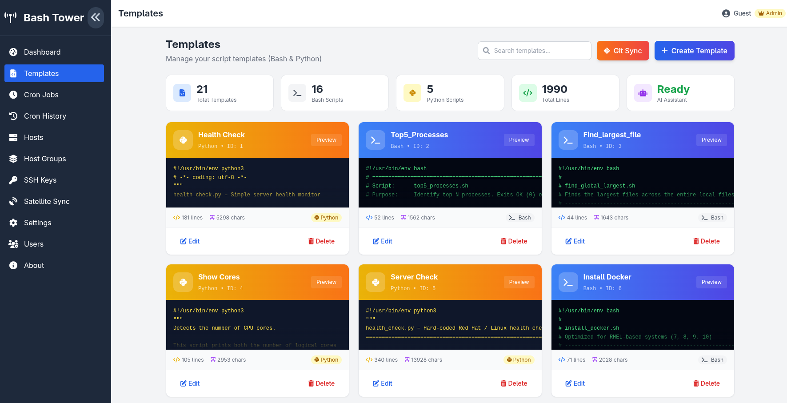

<p align="center">
  
</p>

<h1 align="center">BashTower</h1>

<p align="center">
  <strong>A lightweight, web-based remote script execution platform for home labs</strong><br>
  Designed for hobbyists and home lab enthusiasts managing a small number of servers
</p>

<p align="center">
  <em>Have fun writing your own Bash or Python scripts to automate tasks, save them as templates,<br>
  and easily sync to a Git repository to share with others!</em>
</p>

<p align="center">
  
  
  
  
  <a href="https://hub.docker.com/r/ftsiadimos/bashtower"></a>
</p>

---

## 📸 Screenshots

<p align="center">
  
</p>

---

## 🚀 Features

### Core Functionality
| Feature | Description |
|---------|-------------|
| 🖥️ **Multi-Host Execution** | Run scripts on multiple hosts simultaneously via SSH |
| 📝 **Template Library** | Save reusable Bash & Python script templates with syntax highlighting |
| 🎯 **Dynamic Arguments** | Create parameterized templates with runtime arguments for flexible script execution |
| 🐍 **Python Support** | Execute Python 3 scripts alongside traditional Bash scripts |
| 👥 **Host & Group Management** | Organize hosts into logical groups for bulk operations |
| 🔑 **Secure SSH Key Storage** | Store private keys with AES-256 encryption |
| 📊 **Real-time Job Monitoring** | View live stdout/stderr output with status tracking |
| ⏰ **Cron Job Scheduler** | Schedule recurring script execution with cron expressions |
| 📜 **Execution History** | Complete audit trail with configurable auto-cleanup |

### Integrations
| Feature | Description |
|---------|-------------|
| 🔄 **Git Repository Sync** | Sync your script templates to a Git repository for version control and easy sharing |
| 🤖 **AI-Powered Troubleshooting** | Analyze job errors and get solutions with OpenAI, Google Gemini, or Ollama |
| ✨ **AI Script Assistant** | Generate, improve, and debug scripts using AI directly in the editor |
| 🛰️ **Red Hat Satellite Sync** | Auto-import host inventory from Satellite API |

### Full Backup (Git) 🔁
BashTower can create a **full backup** of your instance and store it in a Git repository. The backup is written to a dedicated `backup` branch and includes:

- Templates (scripts in `scripts/`), plus a `bashtower_backup.json` manifest and a `README.md` with statistics
- Hosts and Host Groups
- Cron jobs (with template and key mapping)
- SSH keys (private keys are excluded by default; can be included if you opt in)
- Users (password hashes excluded by default; can be included if you opt in)
- Application settings (AI config, `auth_disabled`, `cron_history_limit`); API keys included only when sensitive data option is enabled

Security note: sensitive data (SSH private keys, user passwords, API keys, Satellite passwords) are **excluded by default**. Enable the **Include Sensitive Data** option in the UI to include them (only do this for private repositories you fully control).

You can also restore a full backup from the `backup` branch via the Git Sync UI. When restoring you may choose to overwrite existing data (be cautious; this can modify current hosts, templates, cron jobs, SSH keys and users).

### User Experience
| Feature | Description |
|---------|-------------|
| 🎨 **Modern UI** | Clean, responsive interface with Tailwind CSS |
| 🔐 **User Authentication** | Multi-user support with admin roles |
| 📱 **Mobile Friendly** | Responsive design works on any device |
| 🐳 **Docker Ready** | One-command deployment with Docker |

---

## 📋 Table of Contents

- [Quick Start](#-quick-start)
- [Installation](#-installation)
- [Configuration](#-configuration)
- [Usage Guide](#-usage-guide)
- [API Reference](#-api-reference)
- [Architecture](#-architecture)
- [Contributing](#-contributing)
- [License](#-license)

---

## ⚡ Quick Start

### Using Docker (Recommended)

```bash
# Pull and run in one command
docker run -d \
  --name bashtower \
  -p 1008:1008 \
  -v bashtower_data:/app/instance \
  ftsiadimos/bashtower

# Access at http://localhost:1008
```

> **Default Credentials:** Username: `admin` / Password: `admin`

### Using Docker Compose

```yaml
version: '3.8'
services:
  bashtower:
    image: ftsiadimos/bashtower
    container_name: bashtower
    ports:
      - "1008:1008"
    volumes:
      - ./instance:/app/instance
    restart: unless-stopped
```

```bash
docker-compose up -d
```

---

## 📦 Installation

### Prerequisites

- Python 3.9+ (for local installation)
- Docker Engine (for containerized deployment)
- SSH access to target hosts


### Option 1: Local Installation

```bash
# Clone the repository
git clone https://github.com/ftsiadimos/BashTower.git
cd BashTower

# Create virtual environment
python -m venv venv
source venv/bin/activate  # On Windows: venv\Scripts\activate

# Install dependencies
pip install -r requirements.txt

# Run the application
flask run --host=0.0.0.0 --port=1008
```

### Option 2: Development Setup

```bash
# Clone and setup
git clone https://github.com/ftsiadimos/BashTower.git
cd BashTower
python -m venv venv
source venv/bin/activate
pip install -r requirements.txt

# Run in debug mode
FLASK_DEBUG=1 flask run --host=0.0.0.0 --port=5000
```

---

## ⚙️ Configuration

### Environment Variables

| Variable | Description | Default |
|----------|-------------|---------|
| \`FLASK_SECRET_KEY\` | Flask session secret key | Auto-generated |
| \`BASHTOWER_SECRET_KEY\` | Encryption key for SSH keys & API keys | Built-in default |
| \`DATABASE_URL\` | Database connection string | \`sqlite:///instance/bashtower.db\` |

### Security Recommendations

For production deployments:

```bash
# Generate secure keys
export FLASK_SECRET_KEY=\$(python -c "import secrets; print(secrets.token_hex(32))")
export BASHTOWER_SECRET_KEY=\$(python -c "from cryptography.fernet import Fernet; print(Fernet.generate_key().decode())")
```

---

## 📖 Usage Guide

### 1. Initial Setup

1. **Access the UI** at \`http://localhost:1008\`
2. **Create an admin account** on first login
3. **Add SSH Keys** in the Keys section (RSA, Ed25519, or ECDSA)
4. **Add Hosts** with their connection details

### 2. Managing Hosts

```
Hosts → Add Host
├── Name: friendly display name
├── Hostname: IP address or FQDN
├── Username: SSH user
└── Port: SSH port (default: 22)
```

**Host Groups**: Organize hosts into groups for bulk operations (e.g., "Web Servers", "Databases")

### 3. Creating Templates

Navigate to **Templates** and create reusable scripts:

**Basic Bash Script Example:**
```bash
#!/bin/bash
echo "System Info for \$(hostname)"
echo "=========================="
uname -a
df -h
free -m
```

**Dynamic Script with Arguments:**
```bash
#!/bin/bash
echo "Server: {{server_name}}"
echo "Environment: {{environment}}"
echo "Testing port {{port}}..."
nc -z localhost {{port}} && echo "Port {{port}} is open" || echo "Port {{port}} is closed"
```

**Python Script Example:**
```python
#!/usr/bin/env python3
import platform
import psutil

print(f"System: {platform.system()}")
print(f"CPU Usage: {psutil.cpu_percent()}%")
print(f"Memory: {psutil.virtual_memory().percent}%")
```

**Creating Dynamic Templates:**
1. Click **"Add Argument"** to define script parameters
2. Configure each argument:
   - **Variable Name**: Used as `{{variable_name}}` in your script
   - **Label**: User-friendly display name
   - **Type**: text, password, number, or select
   - **Required**: Whether the argument is mandatory
   - **Default Value**: Pre-filled value for convenience
   - **Description**: Help text for users
3. Use `{{argument_name}}` placeholders anywhere in your script
4. Arguments will be prompted for when executing the template

### 4. Running Scripts

1. Go to **Dashboard**
2. Select a **Template** (with Bash/Python indicator)
3. **Fill in Script Arguments** (if the template has dynamic parameters)
4. Choose **Target**: Host Groups or Individual Hosts
5. Select an **SSH Key**
6. Click **Launch Script**
7. Monitor real-time output in the terminal view

**Script Arguments**: Templates with dynamic arguments will display an arguments section where you can:
- Fill in required parameters (marked with *)
- Override default values
- See descriptions for each argument
- Use different values for different environments

### 5. Scheduling Cron Jobs

1. Navigate to **Cron Jobs**
2. Click **Create Cron Job**
3. Configure:
   - **Name**: Job identifier
   - **Template**: Script to run
   - **Schedule**: Cron expression (e.g., \`0 2 * * *\` for daily at 2 AM)
   - **Targets**: Hosts or groups
   - **SSH Key**: Authentication key
4. Enable and save

**Common Cron Expressions:**
| Expression | Schedule |
|------------|----------|
| \`* * * * *\` | Every minute |
| \`0 * * * *\` | Every hour |
| \`0 0 * * *\` | Daily at midnight |
| \`0 2 * * *\` | Daily at 2:00 AM |
| \`0 0 * * 0\` | Weekly on Sunday |
| \`0 0 1 * *\` | Monthly on the 1st |

### 6. AI Integration (Optional)

Configure AI in **Settings** for:

- **Error Analysis**: Get intelligent troubleshooting suggestions
- **Script Generation**: Describe what you need, AI writes the script

**Supported Providers:**
- OpenAI (GPT-3.5, GPT-4)
- Google Gemini
- Ollama (self-hosted, free)

### 7. Red Hat Satellite Sync

If you have a Satellite instance:

1. Go to **Satellite** page
2. Enter Satellite URL and credentials
3. Click **Sync Hosts**
4. Hosts are automatically imported with their details

---

## 🔌 API Reference

BashTower provides a RESTful API for automation:

### Authentication
```bash
POST /api/auth/login
Content-Type: application/json

{"username": "admin", "password": "secret"}
```

### Templates
```bash
# List all templates
GET /api/templates

# Create template with arguments
POST /api/templates
{
  "name": "My Dynamic Script", 
  "script": "#!/bin/bash\necho \"Hello {{name}}!\"\necho \"Environment: {{env}}\"", 
  "script_type": "bash",
  "arguments": "[{\"name\":\"name\",\"label\":\"Your Name\",\"type\":\"text\",\"required\":true},{\"name\":\"env\",\"label\":\"Environment\",\"type\":\"text\",\"default_value\":\"production\"}]"
}

# Run template with arguments
POST /api/run
{
  "template_id": 1, 
  "host_ids": [1, 2], 
  "key_id": 1,
  "arguments": {"name": "John", "env": "staging"}
}
```

### Hosts
```bash
# List hosts
GET /api/hosts

# Create host
POST /api/hosts
{"name": "Server1", "hostname": "192.168.1.10", "username": "root", "port": 22}
```

### Jobs
```bash
# Get job history
GET /api/jobs

# Get job details
GET /api/jobs/{id}
```

---

## 🏗️ Architecture

```
┌─────────────────────────────────────────────────────────────┐
│                        Browser                              │
│                   (Vue.js 3 + Tailwind)                     │
└─────────────────────────┬───────────────────────────────────┘
                          │ HTTP/REST
                          ▼
┌─────────────────────────────────────────────────────────────┐
│                    Flask Application                        │
│  ┌─────────────┐  ┌─────────────┐  ┌─────────────────────┐  │
│  │   Routes    │  │  Services   │  │    APScheduler      │  │
│  │  /api/*     │  │  SSH Exec   │  │   (Cron Jobs)       │  │
│  └─────────────┘  └─────────────┘  └─────────────────────┘  │
│                          │                                  │
│  ┌───────────────────────────────────────────────────────┐  │
│  │              SQLAlchemy ORM                           │  │
│  │         (SQLite / PostgreSQL)                         │  │
│  └───────────────────────────────────────────────────────┘  │
└─────────────────────────┬───────────────────────────────────┘
                          │ SSH (Paramiko)
                          ▼
┌─────────────────────────────────────────────────────────────┐
│                     Remote Hosts                            │
│         (Linux servers, VMs, containers, etc.)              │
└─────────────────────────────────────────────────────────────┘
```

### Tech Stack

| Layer | Technology |
|-------|------------|
| Frontend | Vue.js 3, Tailwind CSS, Font Awesome |
| Backend | Flask 2.x, SQLAlchemy, APScheduler |
| SSH | Paramiko |
| Database | SQLite (default), PostgreSQL (optional) |
| Encryption | Cryptography (Fernet/AES-256) |
| Container | Docker, Gunicorn |

---

## 🤝 Contributing

Contributions are welcome! Here's how to get started:

1. **Fork** the repository
2. **Create** a feature branch
   ```bash
   git checkout -b feat/amazing-feature
   ```
3. **Make** your changes
4. **Test** your changes
   ```bash
   pytest
   flake8 .
   ```
5. **Commit** with a clear message
   ```bash
   git commit -m "feat: add amazing feature"
   ```
6. **Push** and open a Pull Request

### Development Guidelines

- Follow PEP 8 for Python code
- Use meaningful commit messages (conventional commits preferred)
- Add tests for new features
- Update documentation as needed

---

## 📄 License

This project is licensed under the **GPL-3.0 License** - see the [LICENSE](LICENSE) file for details.

---

## 🙏 Acknowledgments

- [Flask](https://flask.palletsprojects.com/) - Web framework
- [Vue.js](https://vuejs.org/) - Frontend framework
- [Tailwind CSS](https://tailwindcss.com/) - CSS framework
- [Paramiko](https://www.paramiko.org/) - SSH library
- [APScheduler](https://apscheduler.readthedocs.io/) - Job scheduling

---

<p align="center">
  Made with ❤️ by <a href="https://github.com/ftsiadimos">ftsiadimos</a>
</p>
